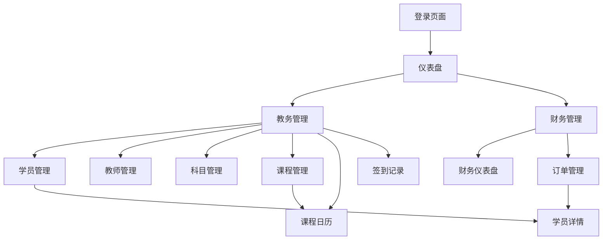

## 1. 产品概述
Vangogh Management System 是专为培训机构设计的综合学员管理系统，旨在简化教务管理、学员跟踪和财务统计流程。系统帮助培训机构高效管理学员信息、课程安排、教师资源和财务状况，提升运营效率和服务质量。

目标用户为培训机构的管理人员、教务人员和财务人员，解决传统手工管理效率低、数据分散、统计困难等问题。

## 2. 核心功能

### 2.1 用户角色
| 角色 | 注册方式 | 核心权限 |
|------|----------|----------|
| 系统管理员 | 后台初始化创建 | 拥有所有功能权限，可创建其他用户 |
| 教务管理员 | 管理员创建 | 学员管理、教师管理、课程管理、签到记录 |
| 财务管理员 | 管理员创建 | 订单管理、财务报表查看 |
| 教师 | 管理员创建 | 查看授课课程、学员签到 |

### 2.2 功能模块
系统包含以下核心页面：
1. **登录页面**：用户身份验证入口
2. **仪表盘**：数据统计概览，包含学员统计、课时消耗等关键指标
3. **学员管理**：学员信息增删改查，支持身份证自动解析
4. **教师管理**：教师信息维护，关联可授科目
5. **科目管理**：课程设置和价格管理
6. **课程管理**：课程安排和排课功能
7. **课程日历**：可视化课程安排展示
8. **签到记录**：学员上课签到管理
9. **学员详情**：单个学员的完整信息展示
10. **财务仪表盘**：收入统计和财务概览
11. **订单管理**：订单创建、修改和状态跟踪

### 2.3 页面详情
| 页面名称 | 模块名称 | 功能描述 |
|----------|----------|----------|
| 登录页面 | 身份验证 | 输入用户名密码进行系统登录，支持记住密码功能 |
| 仪表盘 | 数据统计 | 展示在册学员总数、在读学员数、欠费学员数、当月消耗课时数 |
| 学员管理 | 学员列表 | 展示所有学员基本信息，支持搜索、筛选、分页 |
| 学员管理 | 新增学员 | 录入学员姓名、性别、身份证号、出生日期、家庭住址、紧急联系人等信息 |
| 学员管理 | 编辑学员 | 修改学员基本信息，身份证变更时自动更新出生日期和年龄 |
| 学员管理 | 删除学员 | 软删除学员信息，保留历史数据 |
| 教师管理 | 教师列表 | 展示教师基本信息和可授科目 |
| 教师管理 | 教师编辑 | 维护教师姓名、性别、联系方式、身份证号和授课科目 |
| 科目管理 | 科目设置 | 管理科目名称（硬笔书法、儿童画等）和课程价格 |
| 课程管理 | 课程列表 | 展示课程名称、上课时间、在读学员数、任课老师 |
| 课程管理 | 排课功能 | 设置课程周期（每周/每天/隔周）、上课时间段 |
| 课程日历 | 日历视图 | 以月历形式展示所有课程安排，支持点击查看详情 |
| 签到记录 | 签到列表 | 根据教师、学员、课程、科目、日期筛选签到记录 |
| 签到记录 | 快速签到 | 选择课程后批量为学员签到 |
| 学员详情 | 基本信息 | 展示和编辑学员完整档案信息 |
| 学员详情 | 课程报名 | 展示学员报名的所有课程及剩余课时（排除过期课程） |
| 学员详情 | 订单记录 | 展示学员相关订单信息 |
| 学员详情 | 签到历史 | 按科目、老师筛选学员的上课签到记录 |
| 财务仪表盘 | 收入统计 | 展示全年收入、总消耗课程数、总课时费用 |
| 订单管理 | 订单列表 | 查看所有订单，支持多条件筛选 |
| 订单管理 | 新增订单 | 创建学员报名订单，包含正价课程、赠送课程、费用计算 |
| 订单管理 | 补缴订单 | 创建补缴订单时必须关联原订单，自动计算欠费金额 |

## 3. 核心流程

### 教务管理流程
教务管理员登录系统后，可以进行学员、教师、课程的管理。新学员报名时，先在学员管理录入基本信息，然后在订单管理创建报名订单，接着在课程管理安排合适的课程，最后学员可以通过签到记录进行上课签到。

### 财务管理流程
财务管理员主要负责订单管理和财务统计。收到学员费用后，在订单管理中录入交费信息，系统会自动计算欠费金额和状态。可以通过财务仪表盘查看整体收入情况和课时消耗统计。

### 页面导航流程

## 4. 用户界面设计

### 4.1 设计风格
- **主色调**：蓝色系（#1890ff）为主，体现专业和可信赖
- **辅助色**：绿色（#52c41a）表示成功状态，红色（#ff4d4f）表示警告/错误
- **按钮样式**：圆角矩形，主要操作为实心主色按钮，次要操作为边框按钮
- **字体**：系统默认字体，主要文字14-16px，标题18-24px
- **布局风格**：左侧导航菜单 + 右侧内容区域，卡片式内容展示
- **图标风格**：使用Ant Design官方图标库，线性风格

### 4.2 页面设计概览
| 页面名称 | 模块名称 | UI元素 |
|----------|----------|----------|
| 登录页面 | 登录表单 | 居中卡片布局，包含用户名、密码输入框和登录按钮，背景为渐变色 |
| 仪表盘 | 统计卡片 | 四个彩色卡片展示核心数据，使用图标和数字组合，支持点击查看详情 |
| 学员管理 | 数据表格 | 表格展示学员列表，顶部有搜索框和新增按钮，操作列包含编辑删除按钮 |
| 学员详情 | 信息卡片 | 使用多个卡片分组展示基本信息、课程信息、订单信息，支持标签页切换 |
| 课程日历 | 月历视图 | 月历网格展示，每天显示课程数量和名称，点击日期可查看当日课程详情 |
| 订单管理 | 订单表格 | 表格展示订单列表，状态用颜色标签区分，支持筛选和导出功能 |

### 4.3 响应式设计
系统采用桌面端优先设计，在平板和桌面端提供完整功能体验。移动端通过响应式布局适配，主要功能可在手机端正常使用，复杂的表格操作建议在桌面端完成。

### 4.4 交互优化
- 表单验证：实时验证输入内容，及时给出错误提示
- 加载状态：数据加载时显示加载动画，提升用户体验
- 操作反馈：重要操作（如删除）需要二次确认
- 数据缓存：常用数据本地缓存，减少重复加载