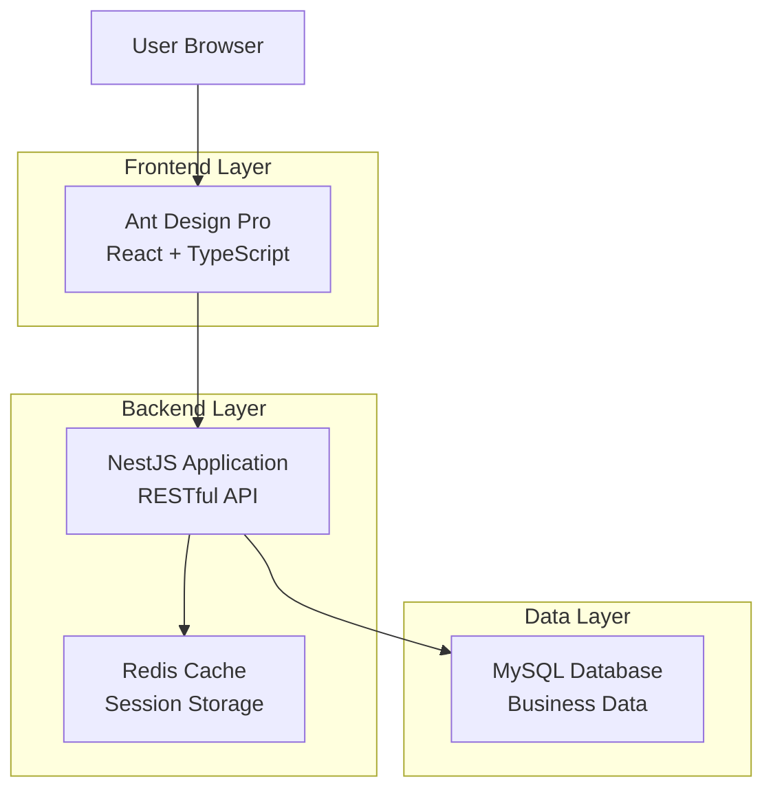
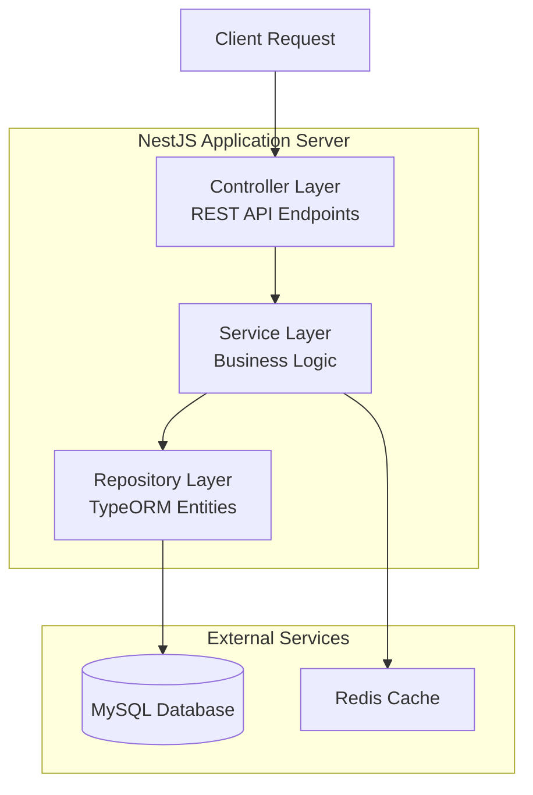
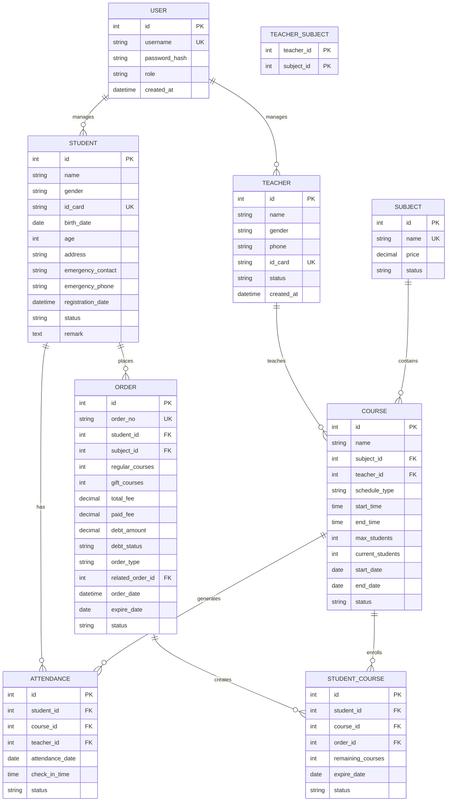

## 1. 架构设计



## 2. 技术描述

- **前端**: Ant Design Pro@6 + React@18 + TypeScript@5 + Umi@4
- **初始化工具**: Ant Design Pro CLI
- **后端**: NestJS@10 + TypeScript@5
- **数据库**: MySQL@8.0
- **缓存**: Redis@7
- **身份验证**: JWT + Passport
- **ORM**: TypeORM
- **API文档**: Swagger/OpenAPI

## 3. 路由定义

| 路由 | 用途 |
|------|------|
| /user/login | 用户登录页面 |
| /dashboard | 系统仪表盘首页 |
| /student | 学员管理列表页面 |
| /student/detail/:id | 学员详情页面 |
| /teacher | 教师管理列表页面 |
| /subject | 科目管理页面 |
| /course | 课程管理页面 |
| /calendar | 课程安排日历页面 |
| /attendance | 签到记录管理页面 |
| /finance | 财务仪表盘页面 |
| /order | 订单管理页面 |

## 4. API定义

### 4.1 认证相关API

**用户登录**
```
POST /api/auth/login
```

请求参数：
| 参数名 | 类型 | 必填 | 描述 |
|--------|------|------|------|
| username | string | 是 | 用户名 |
| password | string | 是 | 密码 |

响应参数：
| 参数名 | 类型 | 描述 |
|--------|------|------|
| access_token | string | JWT访问令牌 |
| user | object | 用户信息 |

### 4.2 学员管理API

**获取学员列表**
```
GET /api/students?page=1&limit=10&search=关键字
```

**创建学员**
```
POST /api/students
```

请求体：
```json
{
  "name": "张三",
  "gender": "男",
  "id_card": "123456200001011234",
  "birth_date": "2000-01-01",
  "address": "北京市朝阳区",
  "emergency_contact": "李四",
  "emergency_phone": "13800138000",
  "remark": "备注信息"
}
```

### 4.3 订单管理API

**创建订单**
```
POST /api/orders
```

请求体：
```json
{
  "student_id": 1,
  "subject_id": 1,
  "regular_courses": 20,
  "gift_courses": 2,
  "total_fee": 2000,
  "paid_fee": 1800,
  "order_type": "new", // new, renew, supplement
  "related_order_id": null, // 补缴时关联原订单
  "expire_date": "2024-12-31"
}
```

## 5. 服务器架构图



## 6. 数据模型

### 6.1 数据模型定义



### 6.2 数据定义语言

**用户表 (users)**
```sql
CREATE TABLE users (
  id INT PRIMARY KEY AUTO_INCREMENT,
  username VARCHAR(50) UNIQUE NOT NULL,
  password_hash VARCHAR(255) NOT NULL,
  role ENUM('admin', 'academic', 'finance', 'teacher') DEFAULT 'academic',
  status ENUM('active', 'inactive') DEFAULT 'active',
  created_at TIMESTAMP DEFAULT CURRENT_TIMESTAMP,
  updated_at TIMESTAMP DEFAULT CURRENT_TIMESTAMP ON UPDATE CURRENT_TIMESTAMP
);

CREATE INDEX idx_users_username ON users(username);
CREATE INDEX idx_users_role ON users(role);
```

**学员表 (students)**
```sql
CREATE TABLE students (
  id INT PRIMARY KEY AUTO_INCREMENT,
  name VARCHAR(50) NOT NULL,
  gender ENUM('男', '女') NOT NULL,
  id_card VARCHAR(18) UNIQUE,
  birth_date DATE,
  age INT GENERATED ALWAYS AS (TIMESTAMPDIFF(YEAR, birth_date, CURDATE())) STORED,
  address VARCHAR(200),
  emergency_contact VARCHAR(50),
  emergency_phone VARCHAR(20),
  registration_date DATE DEFAULT CURRENT_DATE,
  status ENUM('active', 'inactive', 'graduated') DEFAULT 'active',
  remark TEXT,
  created_at TIMESTAMP DEFAULT CURRENT_TIMESTAMP,
  updated_at TIMESTAMP DEFAULT CURRENT_TIMESTAMP ON UPDATE CURRENT_TIMESTAMP
);

CREATE INDEX idx_students_name ON students(name);
CREATE INDEX idx_students_status ON students(status);
```

**订单表 (orders)**
```sql
CREATE TABLE orders (
  id INT PRIMARY KEY AUTO_INCREMENT,
  order_no VARCHAR(20) UNIQUE NOT NULL,
  student_id INT NOT NULL,
  subject_id INT NOT NULL,
  regular_courses INT NOT NULL DEFAULT 0,
  gift_courses INT NOT NULL DEFAULT 0,
  total_fee DECIMAL(10,2) NOT NULL,
  paid_fee DECIMAL(10,2) NOT NULL DEFAULT 0,
  debt_amount DECIMAL(10,2) GENERATED ALWAYS AS (total_fee - paid_fee) STORED,
  debt_status ENUM('normal', 'debt') GENERATED ALWAYS AS (IF(total_fee - paid_fee > 0, 'debt', 'normal')) STORED,
  order_type ENUM('new', 'renew', 'supplement') NOT NULL,
  related_order_id INT,
  order_date DATE DEFAULT CURRENT_DATE,
  expire_date DATE,
  status ENUM('active', 'completed', 'cancelled') DEFAULT 'active',
  created_at TIMESTAMP DEFAULT CURRENT_TIMESTAMP,
  FOREIGN KEY (student_id) REFERENCES students(id),
  FOREIGN KEY (subject_id) REFERENCES subjects(id),
  FOREIGN KEY (related_order_id) REFERENCES orders(id)
);

CREATE INDEX idx_orders_student ON orders(student_id);
CREATE INDEX idx_orders_date ON orders(order_date);
CREATE INDEX idx_orders_status ON orders(status);
```

**签到表 (attendances)**
```sql
CREATE TABLE attendances (
  id INT PRIMARY KEY AUTO_INCREMENT,
  student_id INT NOT NULL,
  course_id INT NOT NULL,
  teacher_id INT NOT NULL,
  attendance_date DATE NOT NULL,
  check_in_time TIME,
  status ENUM('present', 'absent', 'late', 'leave') DEFAULT 'present',
  remark VARCHAR(100),
  created_at TIMESTAMP DEFAULT CURRENT_TIMESTAMP,
  FOREIGN KEY (student_id) REFERENCES students(id),
  FOREIGN KEY (course_id) REFERENCES courses(id),
  FOREIGN KEY (teacher_id) REFERENCES teachers(id),
  UNIQUE KEY unique_attendance (student_id, course_id, attendance_date)
);

CREATE INDEX idx_attendances_date ON attendances(attendance_date);
CREATE INDEX idx_attendances_student ON attendances(student_id);
CREATE INDEX idx_attendances_course ON attendances(course_id);
```